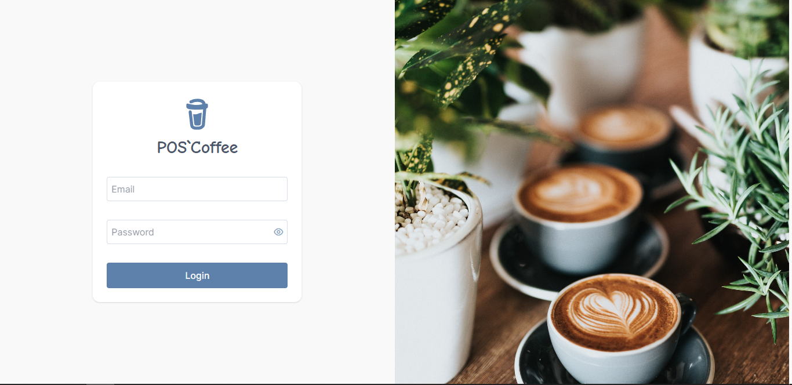
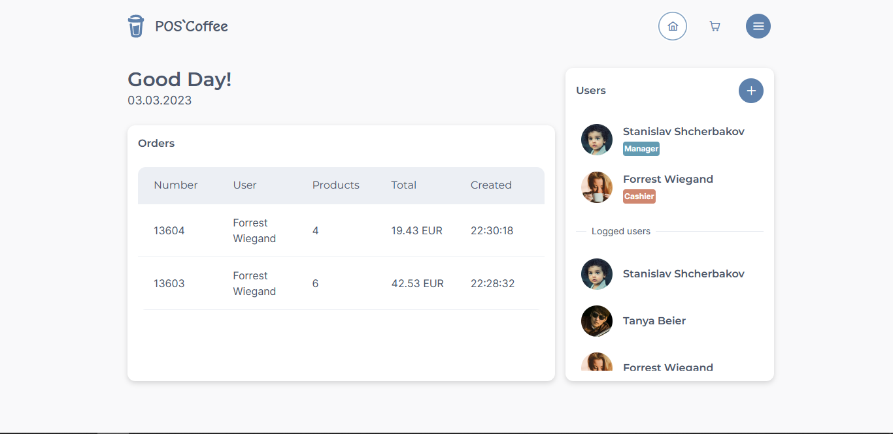
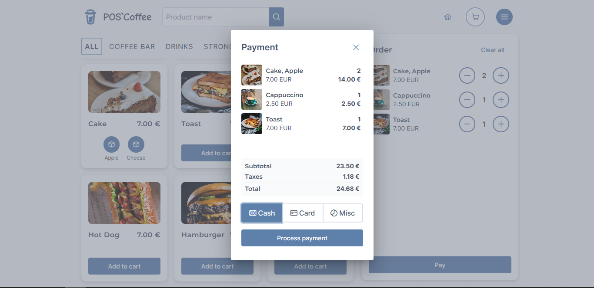
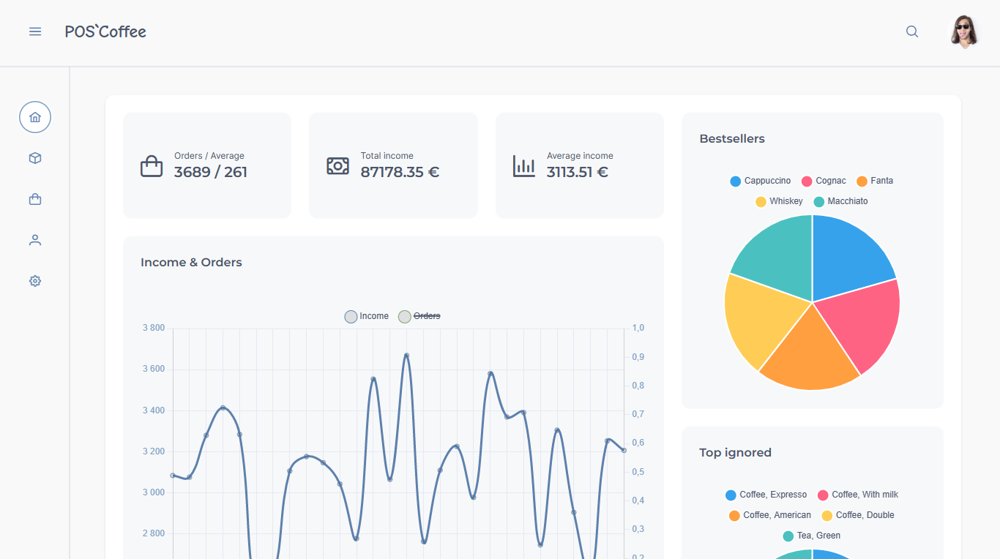
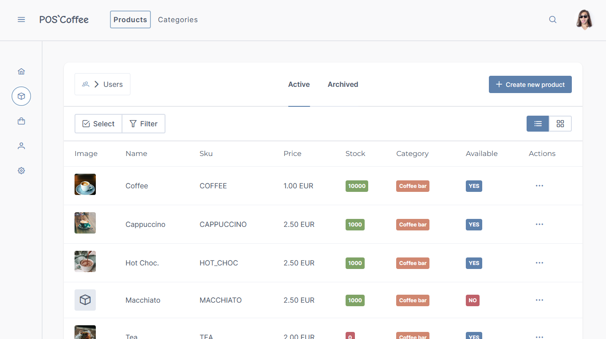
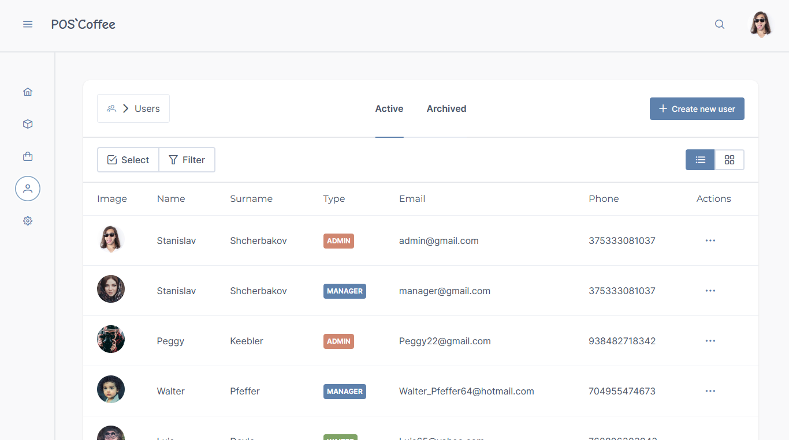
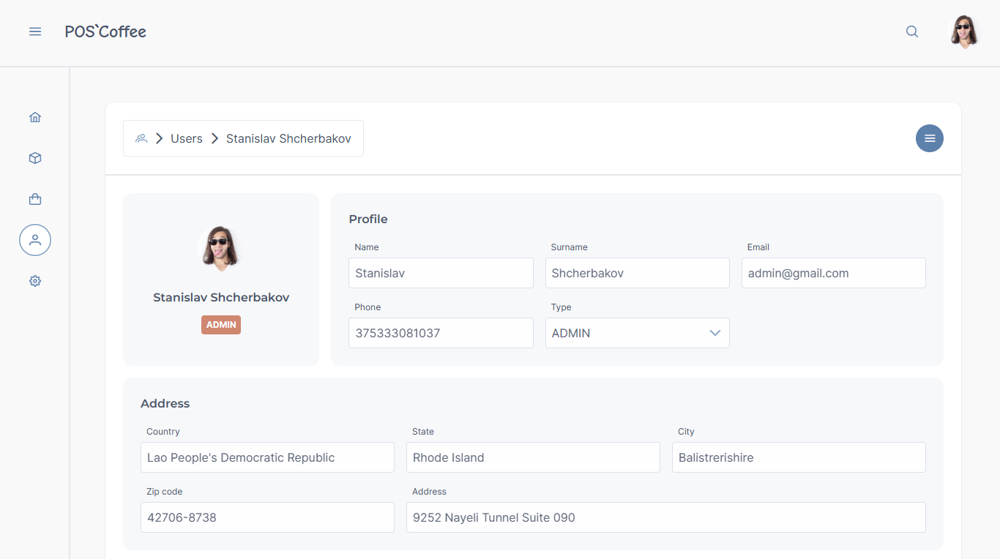
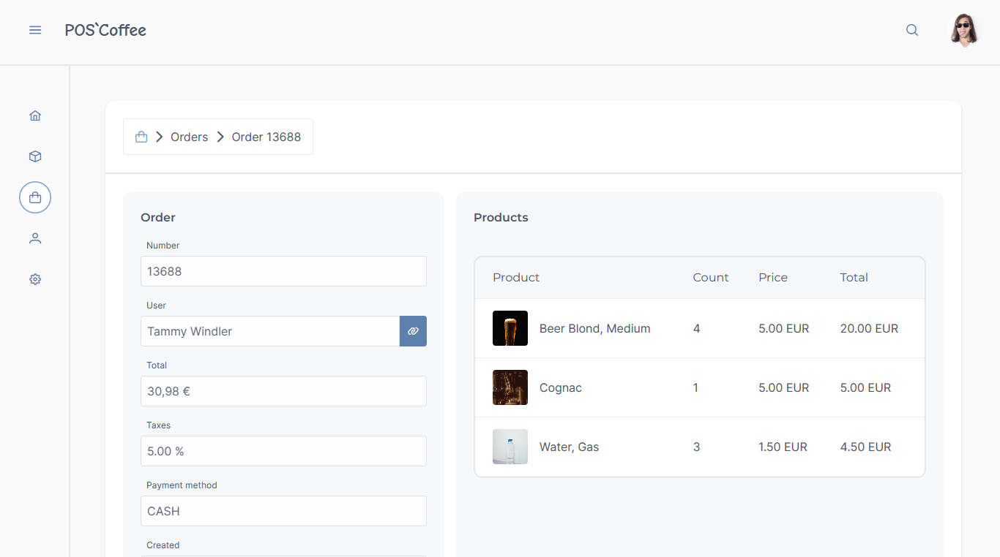

# pos-coffee #

The final project of the Digitazon course

## Description ##

Application to manage a small bar / café.

Contains three modules:

  - **Login** — login a user. Depend on user type after login, the user will be redirected to another appropriate his type module.

  - **Admin** — data management module. Only admin users have access. Here admin can manage users / products / categories / settings and view data statistic and orders.

  - **App** — *"production"* module. Only manager users have access. This is where orders are created.

### Users types ###

  - **Admin** — has access to admin module.
  - **Manager** — has access to app module.
  - **Waiter** — used to create orders.

### Features ###

  - **Models CRUD**: Users, Categories, Products, Product variants, Settings, Orders.
  - **Collect and calculate statistics**: total income / orders, average income / orders per day, total income / orders per day, 5 bestseller products, top 5 *"ignored"* products.
  - **Orders**: create, choose payment method, calculate price, manage product / product variant stock.
  - **Others**: admin search by categories / users / products / product variants, app search among products, filters, pagination, different entities views, JWT security.

### Languages & Tools ###

  - **Frontend**: `TypeScript`, `React.js`, `Tailwind`, `SCSS`.
  - **Backend**: `Java`, `Java Spring`, `MySQL`.
  - **scripts**: `TypeScript`, `faker.js` (generate random data).

### Launch project ###

  1. Generate server config.
     ```bash
     > npm i
     > npm run generate-server-config
     ```
  2. Run Java.
  3. Run clinet.
     ```bash
     > cd client
     > npm i
     > npm run build
     > npm run preview
     ```

## Screenshots ##

**Login**



**App home page**



**App cart page**



**Admin home page**



**Admin products page**



**Admin users page**



**Admin user page**



**Admin order page**


